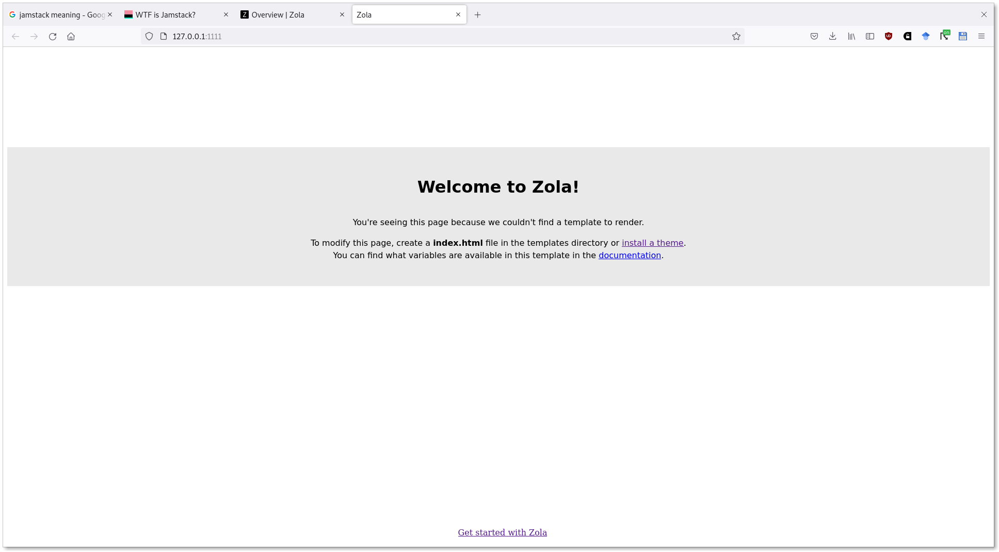

# Static Site Generators

Static site generators (SSG) have become popular for content management, because:

* more people learned a markup language beside HTML, like [textile](https://textile-lang.com/), [markdown](https://en.wikipedia.org/wiki/Markdown) or [RST](https://en.wikipedia.org/wiki/ReStructuredText)
* text is easier to version control
* easier deployment
* fewer resources to maintain
* better security

Many choices:

* [A List of Static Site Generators for Jamstack Sites](https://jamstack.org/generators/)

> JavaScript, APIs, and Markup (JAM) -- [https://jamstack.wtf/](https://jamstack.wtf/)

## Classic CMS

* more complex to setup
* higher maintenance costs
* larger attack surface

Many cases of classic CMS can be addressed by SSG.

## How an SSG works

* content
* templates
* tools that combine content and templates
* various add-ons, themes (depending on project)

Instead of using an application (like wordpress), we use mostly static files,
which can be versioned. The deployable site can be generated, typically with a
single command.

Note: Static sites are a bit like the early web, slightly evolved. Markdown is simpler than HTML. Some people may miss [mildly dynamic web sites](https://www.devever.net/~hl/mildlydynamic).


## Markup: Markdown

> Markdown is a lightweight markup language for creating formatted text using a plain-text editor.

> In 2002 Aaron Swartz created atx, "the true structured text format". Swartz
> and Gruber then worked together to create the Markdown language in 2004,[3][4]
> with the goal of enabling people "to write using an easy-to-read and
> easy-to-write plain text format, optionally convert it to structurally valid
> XHTML (or HTML)"

* [https://en.wikipedia.org/wiki/Markdown](https://en.wikipedia.org/wiki/Markdown) (2004)

Basic syntax cheat sheet: [https://www.markdownguide.org/cheat-sheet/#basic-syntax](https://www.markdownguide.org/cheat-sheet/#basic-syntax)

### Try out markdown online

* [http://docs.exacloud.cc/](http://docs.exacloud.cc/)

## Example Static Site Generator: Zola

* [https://www.getzola.org/](https://www.getzola.org/)

### Installation

* [https://www.getzola.org/documentation/getting-started/installation/](https://www.getzola.org/documentation/getting-started/installation/)

On Ubuntu, we can use [snap](https://www.getzola.org/documentation/getting-started/installation/#snapcraft):

```
$ snap install --edge zola
```

### A First Site

* [https://www.getzola.org/documentation/getting-started/overview/#first-steps-with-zola](https://www.getzola.org/documentation/getting-started/overview/#first-steps-with-zola)

### Local Server

```
$ zola serve
```

----

## Zola: Steps

```
$ zola init zolademo
$ cd zolademo
$ zola serve
```

Going to [http://127.0.0.1:1111/](http://127.0.0.1:1111/) brings up an empty site.



Stop zola (or many other programs) with [CTRL-C](https://en.wikipedia.org/wiki/Control-C).

Conventional directory layout:

```shell
$ tree zolademo/
zolademo/
├── config.toml
├── content
├── sass
├── static
├── templates
└── themes

5 directories, 1 file
```

After tutorial, we see a directory structure similar to this.

```shell
$ tree .
.
├── config.toml
├── content
│   └── blog
│       ├── first.md
│       ├── _index.md
│       └── second.md
├── sass
├── static
├── templates
│   ├── base.html
│   ├── blog.html
│   ├── blog-page.html
│   └── index.html
└── themes

6 directories, 8 files
```

Few things to note:

* separation of templates and content
* templates use inheritance (e.g. inherit from base.html)
* markup is used for content (here: [markdown](https://en.wikipedia.org/wiki/Markdown))
* zola differentiates between "section" pages like "_index.md" and pages like "first.md"

> A section is created whenever a directory (or subdirectory) in the content section contains an _index.md file.

The "_index.md" can hold:

* frontmatter (metadata)
* content

> The _index.md file within a directory defines the content and metadata for
> that section. To set the metadata, add front matter to the file.

There are sections and pages:

> A page is any file ending with .md in the content directory, except files named _index.md.

Example:

* you can create an "about.md" file under the content directory

```markdown
+++
title = "About"
+++

This is an example site.
```

It will require a default template for pages, called "page.html" unter templates; example:

```html



<h1 class="title">
  {{ page.title }}
</h1>
{{ page.content | safe }}

```

To build the site:

```shell
$ zola build

Building site...
Checking all internal links with anchors.
> Successfully checked 0 internal link(s) with anchors.
-> Creating 3 pages (0 orphan) and 1 sections
Done in 25ms.

$ tree public/
public/
├── 404.html
├── about
│   └── index.html
├── blog
│   ├── first
│   │   └── index.html
│   ├── index.html
│   └── second
│       └── index.html
├── index.html
├── robots.txt
└── sitemap.xml

4 directories, 8 files
```

Note that we have a well-rounded site with HTML, robots.txt and sitemap.xml.

* [Robot exclusion standard](https://en.wikipedia.org/wiki/Robots_exclusion_standard)
* [Sitemaps](https://en.wikipedia.org/wiki/Sitemaps)

A few more things we could add:

* [Web feeds](https://en.wikipedia.org/wiki/Web_feed)
* Site search (client side, example: [https://adidoks.netlify.app/](https://adidoks.netlify.app/))

----

## Deployment

We can work locally, then deploy our generated site to a remote server.

General steps:

* develop and test locally
* build site
* deploy site (copy to remote server)

Specifically:

> Replace "username" with your username (e.g. u1234567) and server with "exacloud.cc" - you will be prompted for your password.

```shell
$ zola build
$ rsync -avz public/* username@server:/home/username/public_html/
```

### Notes

#### Changing password

You can change your password anytime with the `passwd` command - it will ask for
your current password and for a new password and a confirmation

#### Remote access

With a user account on a remote server, you can access the server with a secure
shell (ssh). The general command would be:

```shell
$ ssh username@server
```

After that, you will be dropped into a shell. The remote server is a Linux
server, very similar in structure to the (virtualized) Linux operating system
you may be using.
