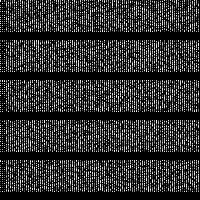

# Generated Gif File

An grayscale image is a 2D array. With
[imageio](https://pypi.org/project/imageio/) we can prepare frames, then
assemble a gif file.

Idea: Find some interesting function, pattern or data to psuh into a
rectangular form and then into a gif.

Example.

```
$ python main.py
```

A broken TV!



