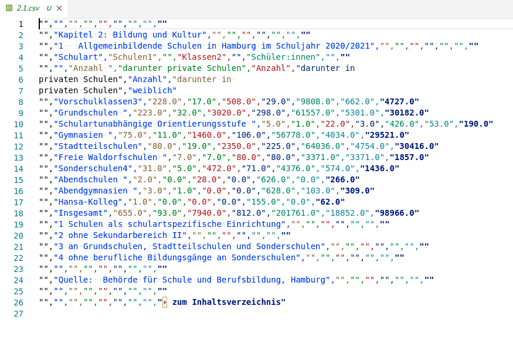

# Open Data Hamburg

* [ ] Search for a dataset at [https://www.govdata.de](https://www.govdata.de), [https://transparenz.hamburg.de/open-data/](https://transparenz.hamburg.de/open-data/), or any other open data portal; formats may be CSV, XLSX, ...
* [ ] Prepare the data, if necessary (cleaning, filtering, ...)
* [ ] Explore the data in a Jupyter Notebook or with a script

Submission:

* 1 Jupyter Notebook (code and comments)

## Example ideas

### Animal Sightings in Hamburg (Artenkataster)

* [https://www.govdata.de/web/guest/suchen/-/details/artenkataster-tiere-hamburgf53ee](https://www.govdata.de/web/guest/suchen/-/details/artenkataster-tiere-hamburgf53ee)

> Das Artenkataster enthält alle Fundortdaten zu Tierarten aus beauftragten
> Kartierungen und von ehrenamtlich Tätigen, die der Behörde für Umwelt und
> Energie, Abt. Naturschutz, vorliegen. Die veröffentlichten Daten beinhalten
> Beobachtungen von Tierarten seit 1900 bezogen auf ein 1x1 km Raster. Der
> Downloaddienst stellt das Raster im Shape-Format in ETRS89/UTM- Abbildung
> bereit. Auskunft zu Vögeln erteilt Frau B. Krebs (s. Ansprechpartner).

This is a larger dataset (about 150MB XML file), but relatively regular. Some possible questions:

* How many different animals have been seen in Hamburg over the years?
* Which are the most (least) observed animals?
* Which animals have a declining number of sightings? Which one have an increase?
* Plotting number of sightings over the years (e.g. for one or a few species)

### Other ideas

There are 53704 datasets on [https://www.govdata.de](https://www.govdata.de) as of 06/2022 ([24353](https://www.govdata.de/web/guest/suchen/-/searchresult/f/format%3Acsv%2C/s/relevance_desc) im CSV-Format).

* Lärmdaten Hamburg: [https://www.govdata.de/web/guest/suchen/-/details/larmkarten-hamburg-47c-blmschg](https://www.govdata.de/web/guest/suchen/-/details/larmkarten-hamburg-47c-blmschg)
* Straßenbaumkataster Hamburg: [https://www.govdata.de/web/guest/suchen/-/details/strassenbaumkataster-hamburg](https://www.govdata.de/web/guest/suchen/-/details/strassenbaumkataster-hamburg)
* ...

Energie-Indikatoren (international):

* [https://www.govdata.de/web/guest/suchen/-/details/internationale-indikatoren-umwelt-und-energie-staaten-jahre](https://www.govdata.de/web/guest/suchen/-/details/internationale-indikatoren-umwelt-und-energie-staaten-jahre)

## General questions to ask

* What's in the dataset?
* How *machine-readable is it*?

For example, [Statistische Jahrbuch
Hamburg](https://suche.transparenz.hamburg.de/dataset/statistisches-jahrbuch-hamburg-2020-2021)
CSV-Files are hard to read for a machine. Those files have most likely exported
from Excel-Files and hence have less predictable structure. This make some of
that data very hard to use.

* How complete is the dataset? How much is missing?
* How consistent are the values?
    * Are dates consistent?
    * Are integers and strings mixes?
* How easy is it to load the data? How much preprocessing is necessary?
* ...

