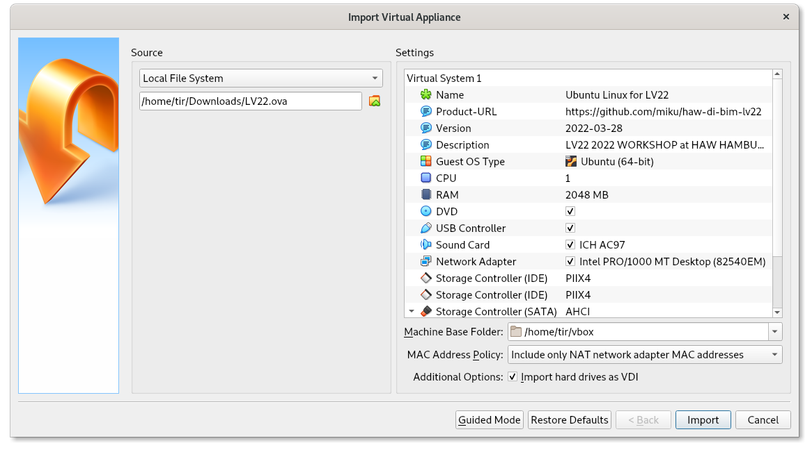

# Virtual Machine

A virtual machine (vm) image for LV2.2/2022 for experimentation.

## Download

* [https://cloud.haw-hamburg.de/index.php/s/1ShfNH86zCIJxG8/download](https://cloud.haw-hamburg.de/index.php/s/1ShfNH86zCIJxG8/download) (password: lv22) -- 7.9GB

Note that with a 100Mbit connection the download may take up to 20 minutes. Please be aware of any expenses if you use mobile data to connect.

## Virtual Machine Username and Password

* Username: lv22
* Password: lv22

The VM is based on a minimal [Ubuntu 20.04.4 LTS](https://ubuntu.com/download/desktop) (iso sha1: cd90ca5e95a4479cb1e31402988d49357e4ac261).

## How to use

* [ ] Download [VirtualBox](https://en.wikipedia.org/wiki/VirtualBox) open source
  virtualization software for your operating system (e.g. MacOS, Windows,
  Linux, ...): [https://www.virtualbox.org/wiki/Downloads](https://www.virtualbox.org/wiki/Downloads) -- learn more about what VirtualBox is on Wikipedia: [VirtualBox](https://en.wikipedia.org/wiki/VirtualBox), [Hypervisor](https://en.wikipedia.org/wiki/Hypervisor)
* [ ] Download virtual machine image for this course from: [https://cloud.haw-hamburg.de/index.php/s/1ShfNH86zCIJxG8/download](https://cloud.haw-hamburg.de/index.php/s/1ShfNH86zCIJxG8/download) (password: lv22)
* [ ] Start VirtualBox
* [ ] Import Appliance
    * [ ] Source: Local Filesystem
    * [ ] Select the downloaded file: LV22.ova
    * [ ] Click "Import" (this may take a few minutes)



## Software Installed

* [x] code editor, e.g. [VS Code](https://code.visualstudio.com/) - including plugins for Python, HTML, CSS
* [x] firefox, google chrome
* [x] extra: bat, procs, dust

Packages:

* antiword
* bash-completion
* bash-doc
* bzip2
* catimg
* curl
* docker-compose
* docker.io
* emacs
* gifsicle
* git
* git-extras
* git-gui
* golang
* golang-doc
* hollywood
* htop
* hugo
* imagemagick
* ipython3
* jq
* jupyter
* libreoffice
* libxml2-dev
* libxml2-utils
* links
* moreutils
* nano
* ncdu
* npm
* p7zip
* pandoc
* pdfgrep
* pdfsam
* pigz
* pngphoon
* poppler-utils
* python-is-python3
* python3
* python3-imageio
* python3-nltk
* python3-pandas
* python3-pandocfilters
* python3-pip
* python3-requests
* python3-scrapy
* ranger
* rar
* screen
* sqlite3
* sqlite3-doc
* sqlitebrowser
* ssh
* texlive
* texlive-extra-utils
* tidy
* tig
* tmux
* tree
* unzip
* vim
* visidata
* wget
* xsltproc
* xslx2tsv
* xzip
* yaz
* yaz-doc
* zstd

Additional setup; [Rust](https://www.rust-lang.org/) programming language:

```
$ curl --proto '=https' --tlsv1.2 -sSf https://sh.rustup.rs | sh
```

Additional installations through language specific package managers.

```
$ cargo install tokei
$ cargo install xsv
$ go install github.com/EricChiang/pup@latest
$ go install github.com/charmbracelet/glow@latest
$ go install github.com/miku/metha/cmd/...@latest
$ pip install csvkit
$ pip install marcx
$ pip install pymarc
$ pip install xml2dict
```


## Your VM

This is your experimental VM. It runs in a sandbox, you can hardly break
anything. There is always a fresh copy to start over (if you need).

